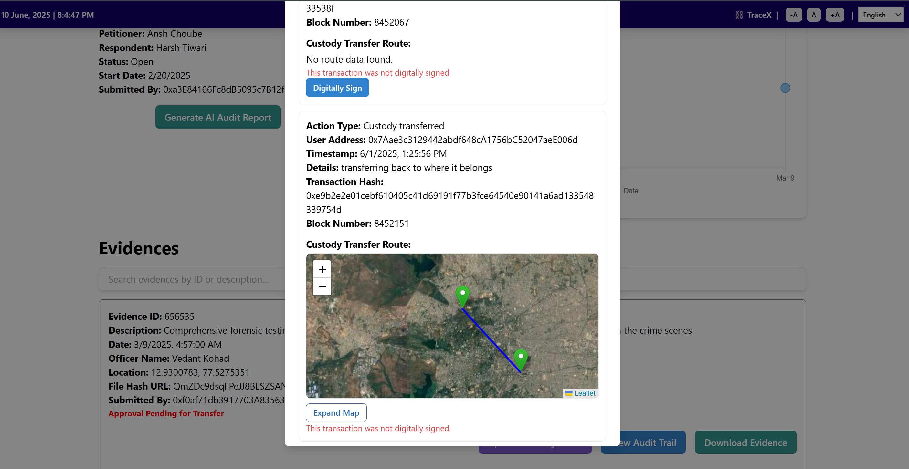
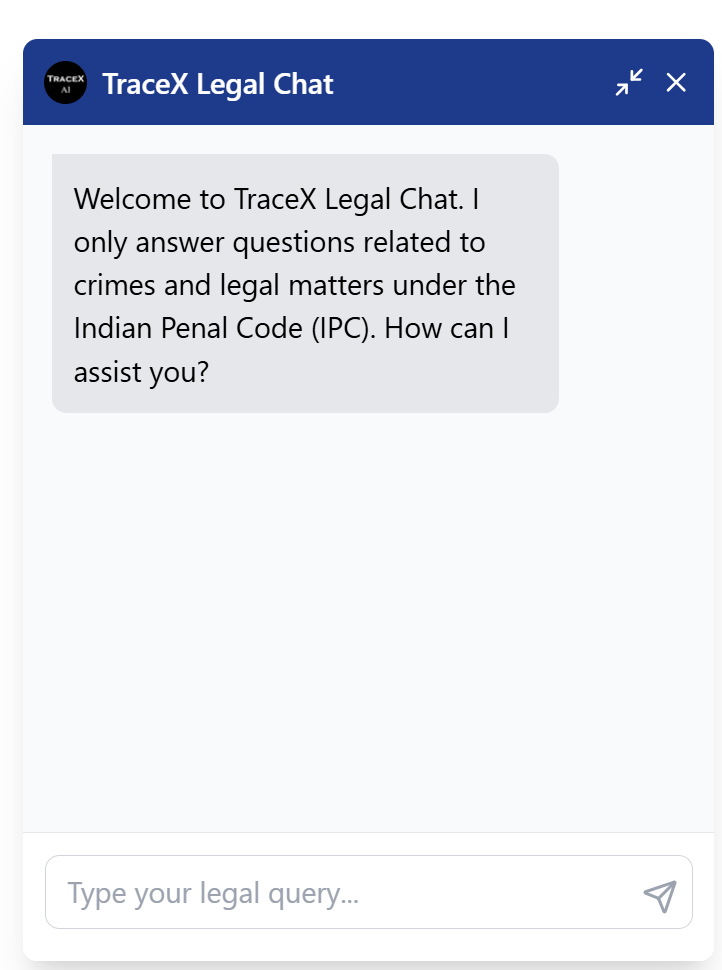
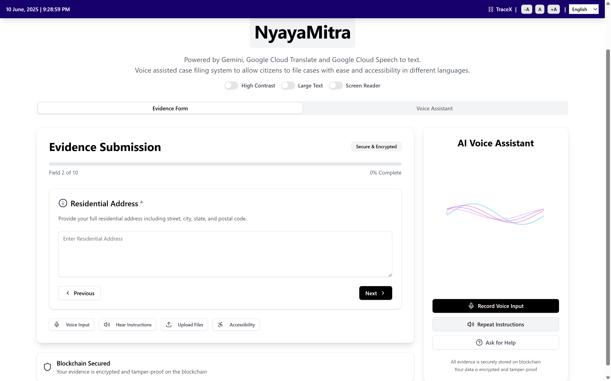

***Drastic changes have been made to adopt Google Technologies within the system to further Global good. Following is a list of changes that were made in the prototype refinement phase and the Google Dev tools they adopt:***

1. We have successfully integrated Google Maps into our platform, enabling Collectors and Analysts to define and manage routes for the secure transfer of physical evidence during custody handovers. Each transfer is geotagged, with route coordinates systematically stored in MongoDB. Leveraging the **Google Maps API** and high-resolution tiles from **Google Earth Engine**, the system provides real-time tracking and precise route recording, ensuring enhanced transparency and accountability throughout the evidence transfer process. (See figure 1)

2. We have further integrated with **Firebase** as mentioned here:
    - <a href="https://github.com/VidyutChakrabarti/TraceX/blob/latest/Docs/UserJourneys.md">Know more about User Journeys</a> 

    - Firebase integration now allows us to store user related information like subscription list (for cases) and also authenticate using OAuth and Mail extremely efficiently. (See Figure 2) 

3. We have made more Integrations with **Google AI** using more advanced Gemini models like gemini-flash-2.0 for chatbots and also use AI agents using **Google Agents ADK** to process mails and automate the process of account address creation in web3 and subsequent handling of the mail to the user who requested access to a particular case in subscription list. (See figure 3)

4. We have intorduced a completely new use case within our application for more social good. This new feature of TraceX is called "NyayaMitra". It is integrated with **Google Cloud text-to-speech, Gemini and Google Translate** for allowing users of various backgrounds to fill out case/law related forms with ease. We use voice assistance in multiple languages to guide the user in filling forms which may seem too complex. Thus TraceX now has a new cause of bringing Justice to more underprivileged communities and people who may not have the means to fill out legal forms with the assitance of **Google AI**. (See Figure 4)

5. We can further use Google Cloud storage as a backup for all the data within the blockchain and use Google Big Query for querying blockchain data, thus making the hash matching for integration checking of evidences much more scalable.

  

| Figure 1: Google Maps Use                             | Figure 2: Firebase Authentication and Storage        |
|-------------------------------------------------------|------------------------------------------------------|
|        |   |

| Figure 3: Google AI                                   | Figure 4: NyayaMitra                                 |
|-------------------------------------------------------|------------------------------------------------------|
|                |               |

