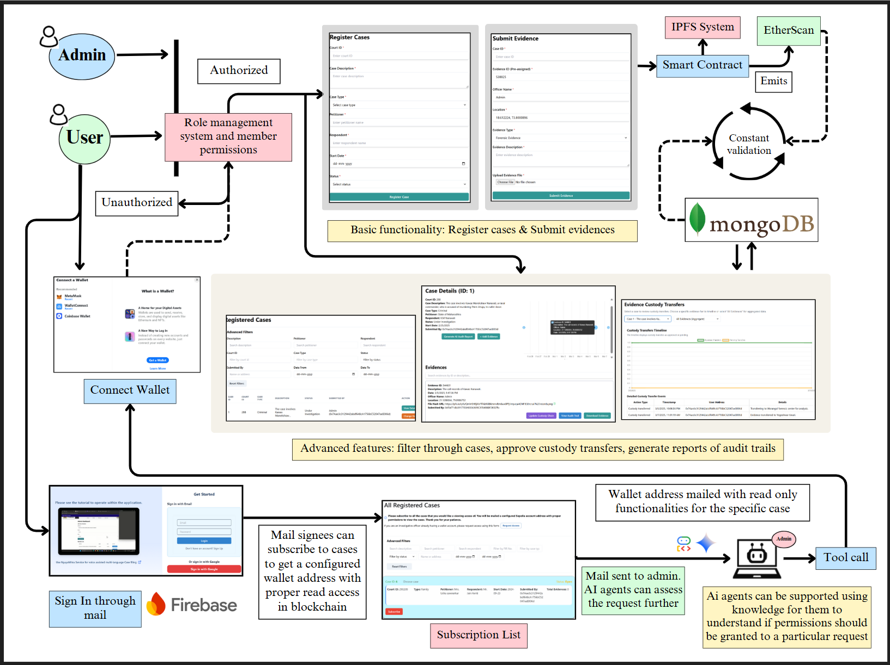
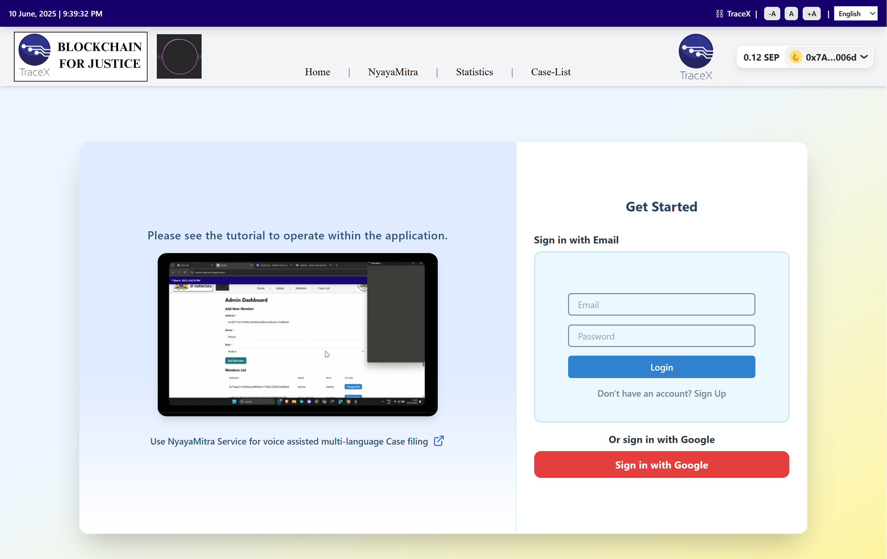
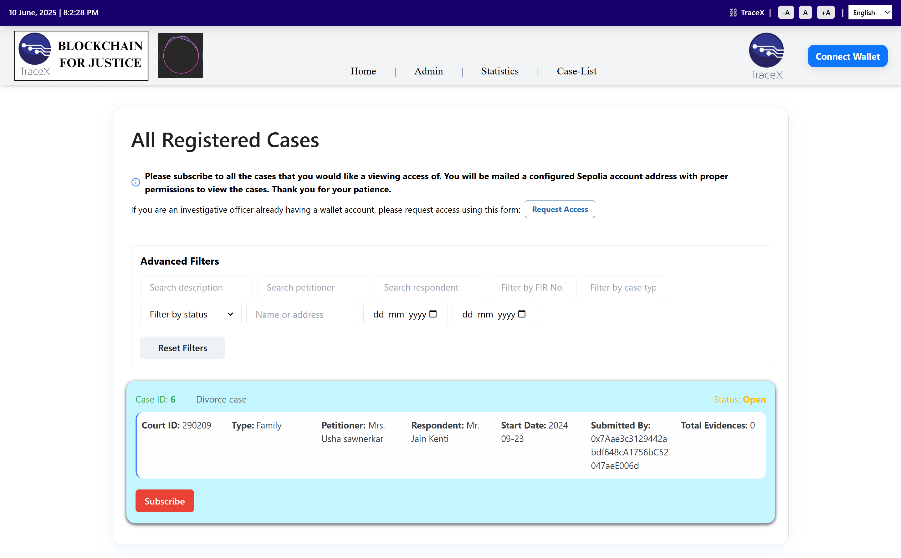
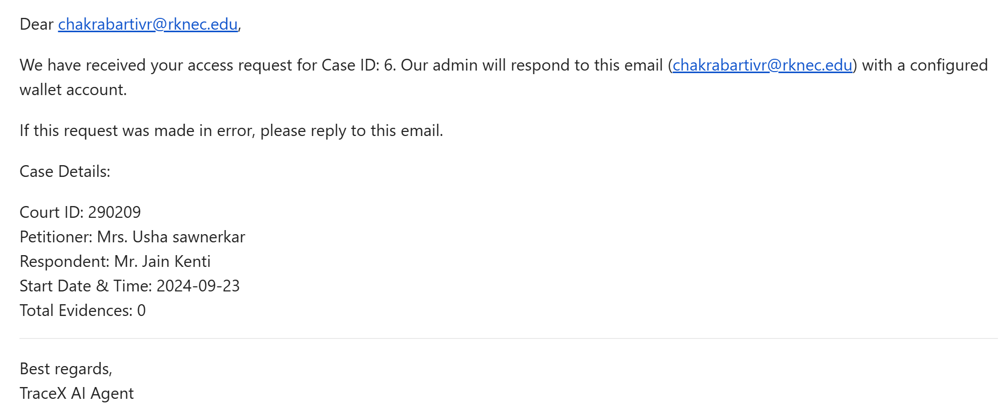
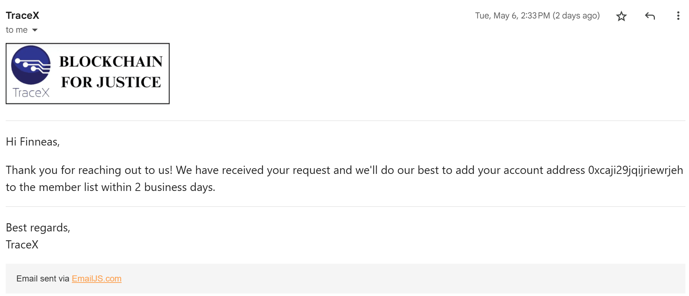

***The new version of TraceX features new User Journeys supported via firebase authentication and storage.***

1. We now allow users who do not have a preconfigured wallet address on the blockchain to sign up on TraceX using email or OAuth via Firebase authentication.
2. After signing up, users can choose from a list of registered cases within the application. When the Subscribe button is clicked, an email is sent to the Admin and AI agents. These agents assess the validity of the request and the permission sought in relation to the selected case. Based on this evaluation, the Admin agent configures a wallet address and sends it back to the subscriber, along with instructions on how to import the account into MetaMask. The user can then proceed with a viewer role within the application by connecting their wallet.
3. The user can now view and follow the evidence trails and all details related to the case they are subscribed to.
4. Subscription data and user-specific information are stored using Firebase Storage.

**How this helps:** 
1. This additional user journey significantly expands the scope and user base of the application. It is no longer limited to investigative officers or organizations with read-write access, but also includes individuals who can subscribe to cases and gain view-only access to all evidence trails and related details. 
2. This feature has the potential to revolutionize how cases are handled by making the entire process more transparent and trustworthy, furthering the cause of social justice and aligning with ***UN SDG 16. Peace, Justice and Strong Institutions.***

### New UserFlow diagram:

The user journeys after the granting of the correct wallet address within the Sepolia chain almost remains same. The user now gets a full view of the Audit trails and etherscan tamper reports of all the evidences related to a particular case and can issue more requests using the case viewer page.

***A guide to Requesting proper access within the system if you are Just a viewer:***
1. Click on the get started button in the homepage itself. 
2. You will be routed to a signup/signin page where you can either signin through your mail or your google account.

  

3. Next you will be allowed to choose from a list of cases which has been registered within the platform. You must only subscribe to the cases for which you want a viewing access of the evidences and details related to the case. 

  

4. An email is sent to Admin Agent as soon as the subscribe button is clicked. You will also receive a confirmation mail for the application. 

  

For now admin agent will reply to all requests with a valid wallet account address with proper configs and permision to view that case.

***If you are an investigative officer with an already valid wallet address and wish to request a proper role within the application for CRUD functionalities then you will be routed to "/request-access" or you can visit:***

-- <a href="https://tracex-drab.vercel.app/request-access">Request Access (for roles)</a>

Upon successful processing of request for role within the platform you will receive an email confirmation: 

  

**Note:** This step is not for the users who get their wallet address from the system itself, their accounts will already be configured with proper permissions.

Please relocate here if you wish to see what's more in store in the refined TraceX: 

