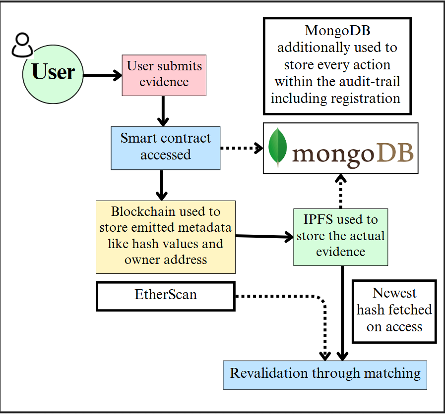
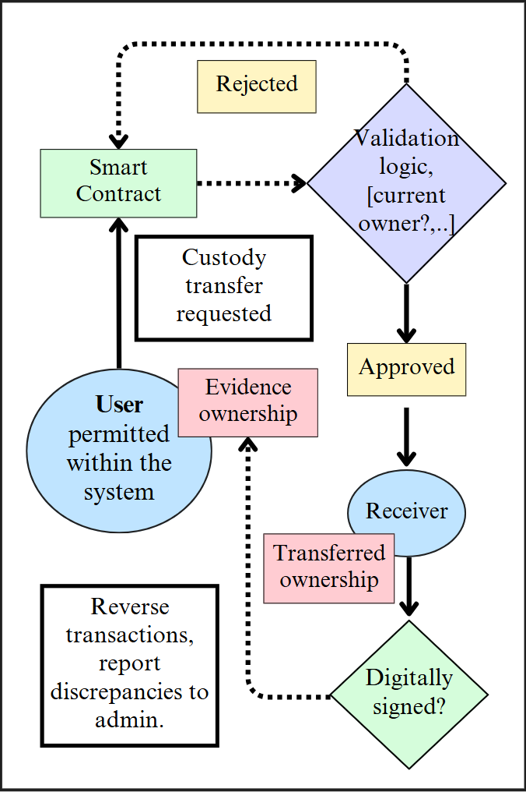
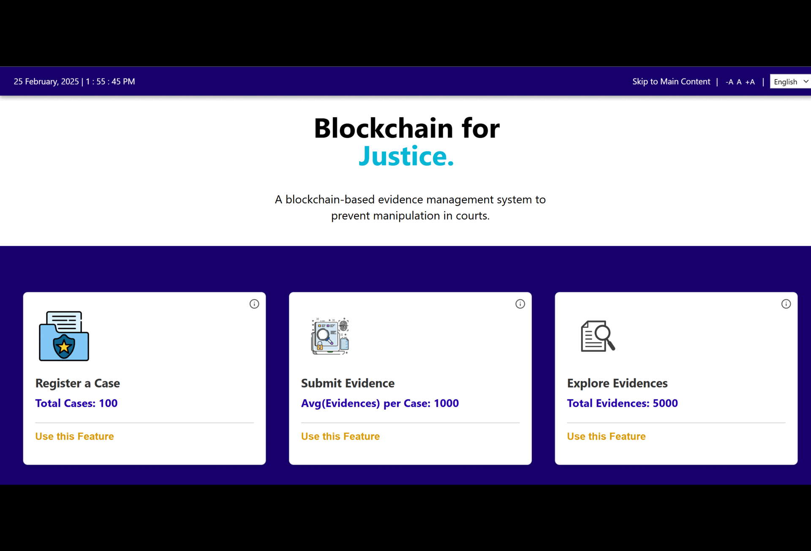

# TraceX ⛓️

TraceX is an evidence management system designed to preserve the integrity of evidence in courts. This Decentralized Application enables users to upload evidence for any case number, ensuring data remains secure and transparent throughout its lifecycle.
TraceX incorporates a robust chain of custody feature, meticulously documenting each transfer of evidence to maintain a clear and unalterable record of its handling from collection to court presentation. Furthermore, digital signatures provide an additional layer of authentication and security, ensuring that only authorized individuals can access and manage the evidence.
TraceX creates a comprehensive digital trail, preventing any possibility of tampering and safeguarding the evidence's authenticity and reliability throughout the judicial process.


### To run the application in local, use: 
```bash
npm i
```
```bash
npm run dev
```

Please Use the following links to know more about the refined version:<br><br>
<a href="https://github.com/VidyutChakrabarti/TraceX/blob/latest/Docs/Refinements.md" target="_blank">
    
  </a>

  <a href="https://github.com/VidyutChakrabarti/TraceX/blob/latest/Docs/UserJourneys.md" target="_blank">
    
  </a>


### UserFlow diagram:


### Understand how we validate integrity of evidences & handle custody transfers:

| Validation | Custody Transfers |
|---------|---------|
|  |  |

### Gallery: 


### Watch our video to understand how to use the features: 
[](https://www.youtube.com/watch?v=QYnjaIpiTPc)

Please see the user-journeys readme
<a href="https://github.com/VidyutChakrabarti/TraceX/blob/latest/Docs/UserJourneys.md">here</a> to know more about how to access the application properly

------------- Previous version -------------<br>

**Note:** In order to access the application fully in deployed mode, you must first have a proper role that can only be assigned by the Admin. You will be automatically re-routed to the form where you can submit the application. On successful processing you will get the confirmation email.<br/>
<br/><br>


