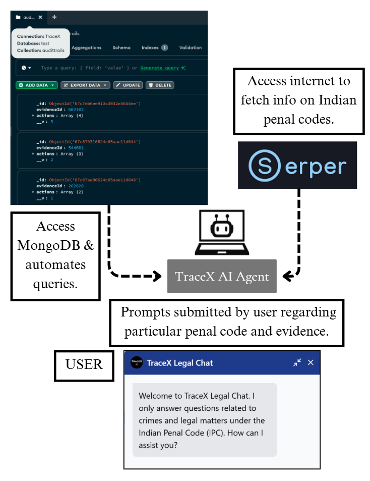
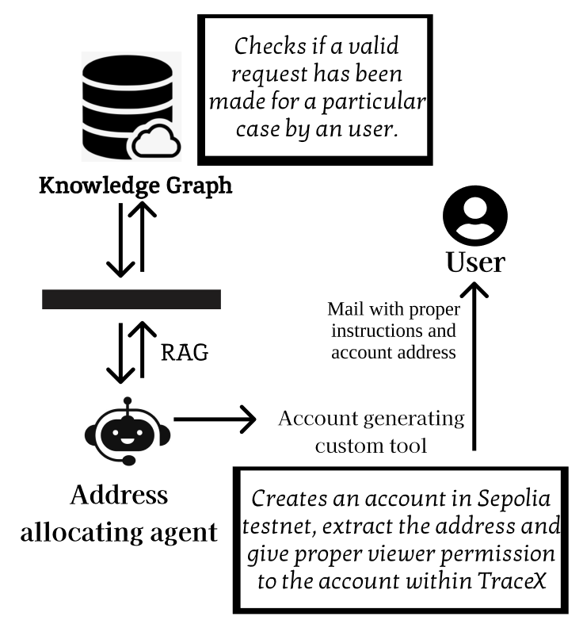

1. The TraceX AI Chatbot is a legal query assistant that interacts with users to answer questions specifically related to the Indian Penal Code (IPC). It operates by:

    Accessing a MongoDB database to fetch and associate user queries with evidence entries (like evidenceId).

    Utilizing the Serper API to retrieve updated legal information from the internet.

    Acting as a natural language interface to streamline legal information retrieval and database access for end users.

    - Purpose:
    To assist citizens and legal professionals in understanding IPC provisions, link them to digital evidence, and reduce manual legal lookups.

    </img>
  

2. The TraceX Account Allocation Agent leverages Google Agents ADK to automate Web3 account provisioning in response to user subscription actions. Specifically:

    When a user subscribes to a case, the agent is triggered.

    It processes the associated request email, verifies intent (through knowledge graphs, for now it is open to all), and then automatically creates a Web3-compatible account address in Sepolia testnet.

    After account creation, it handles the follow-up communication, sending the generated credentials or access details to the respective user securely.

    </img>
  